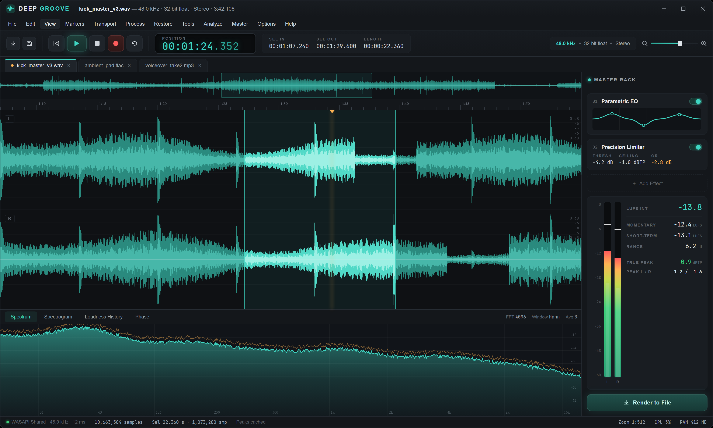

# WaveLab

A sleek audio editor and mastering suite for Windows, built with WPF on .NET 10.



## Features

**Formats & files** — sample-accurate WAV (16/24-bit PCM and 32-bit IEEE float) and AIFF/AIFF-C import, with native classic AIFF 16/24/32-bit PCM output, explicit dithered or undithered 16-bit output and Open As conversion to 16/24/32-bit; MP3/FLAC/M4A/WMA import; direct CD-DA track discovery, selection, extraction and import from Windows optical drives; export to WAV, AIFF, MP3, AAC, WMA and FLAC (where Windows provides the encoder) with bitrate choice, sample-rate conversion and selection-only export; batch converter with LUFS/peak normalization and effect-chain processing; recent files, session restore, autosave with crash recovery. AIFF-C is import-only. Imported AIFF-family files must be saved to a different `.aif` or `.aiff` path so WaveLab cannot overwrite ancillary metadata it does not preserve.

**Editing** — multi-resolution waveform with zoom to sample level and vertical amplitude zoom (Ctrl+wheel); drag selection; cut/copy/paste/delete/trim; unlimited undo/redo with a configurable memory budget; markers and named regions with ruler flags, navigation shortcuts, a manager panel and sidecar persistence; edit-point smoothing (de-click joins); silence detection, trimming and split-to-regions.

**Master rack** — reorderable real-time effect chain with Gain & Trim, Level Normalizer, phase-safe Mono-to-Stereo and Stereo Width, Channel Balance & Alignment, Noise/Hiss Reduction, Hum Removal, Studio EQ, Compressor, Noise Gate, Reverb, Stereo Delay, Chorus, Saturation, Low/High-Pass Filters and a 5 ms lookahead Precision Limiter. Every effect has bypass, remove, move and **reset-to-default**, with a global rack bypass that preserves individual settings; chains save/load as presets, including Vinyl Cleanup, Mono Record Presence and Clean Transfer. **Analyze & Tune** examines representative quiet and musical passages, explains its confidence-backed recommendations, provides selective dry/tuned A/B preview, and builds custom Vinyl Cleanup or Clean Transfer settings without modifying the source or overwriting factory presets. The chain applies to a selection or renders to a new tab with latency compensation. True mono sources are promoted to stereo only when the enabled mono-to-stereo processor needs it.

**Processing** — gain, normalize, equal-power fades, reverse, DC removal, silence insertion; channel tools (swap, phase invert, balance, mono↔stereo, channel extraction); WSOLA time stretch and pitch shift; windowed-sinc sample-rate conversion.

**Restoration & CD transfer** — an analysis-first vinyl workbench scans the complete file offline (without playback), detects clicks, pops and flat-topped clipping while protecting musical attacks, and visibly tunes its repair, noise and hum controls from the measurements; includes adjustable click repair, peak reconstruction/declipping, learned or automatic noise profiling, hiss reduction and 50/60 Hz hum removal. Gentle/Balanced/Strong presets, wet/dry control, bypass A/B and a separate bounded audition leave the source untouched until one undoable apply. The handoff auto-splits quiet gaps into reorderable, splittable tracks with editable In/Out points, previews the exact dry or rack-rendered path, then emits gapless, 588-frame-aligned 44.1 kHz/16-bit WAV files plus a CUE sheet through staged, cancellation-safe publishing.

**Analysis** — real-time spectrum analyzer, offline spectrogram, loudness history graph, goniometer with stereo correlation and balance; peak/RMS meters with hold; EBU R128 momentary/short-term/integrated LUFS, LRA and true peak; per-file audio statistics with clipping count; pitch detection (tuner) and tempo/BPM estimation.

**Recording** — WASAPI capture with device picker and live peak/RMS/hold meters; a vinyl-oriented **Recording Level Assistant** runs a discard-safe preflight scan, measures intersample peak, estimated transient headroom, program RMS, crest factor, channel balance and clipping, then recommends a linked input-gain reduction or an optional conservative increase before the take. The monitor stream switches atomically into retained recording so calibration audio never enters the take. A transport **Arm** control starts the selected persisted input immediately when Record is pressed; metronome count-in at any BPM; click track while recording; punch-insert into the current selection with smoothed joins. Capture finalization waits for the device tail, keeps interrupted takes recoverable, and marks every new recording as unsaved.

**Workflow** — settings dialog (devices, buffer/latency, autosave, export defaults) with restore-defaults; searchable command palette (Ctrl+Shift+P); window placement memory; CPU/RAM readouts; drag-and-drop and command-line file open.

## Building

Requires the .NET 10 SDK (ships with Visual Studio 2026).

```
dotnet build WaveLab.sln -c Release
dotnet run --project src/WaveLab
```

## Keyboard shortcuts

Space play/pause · Home go to start · Ctrl+O/S/Shift+S open/save/save-as · Ctrl+E export · Ctrl+Z/Y undo/redo · Ctrl+X/C/V/Del edit · Ctrl+A select all · Ctrl+= / Ctrl+- / Ctrl+0 zoom · Ctrl+M marker · Ctrl+Shift+M region · Alt+←/→ marker navigation · Ctrl+R record · Ctrl+Shift+P command palette · wheel zoom · Shift+wheel pan · Ctrl+wheel amplitude zoom

UI typefaces: [Inter](https://rsms.me/inter/) and [JetBrains Mono](https://www.jetbrains.com/lp/mono/), embedded. Design mockups and the feature roadmap live in `docs/`.
